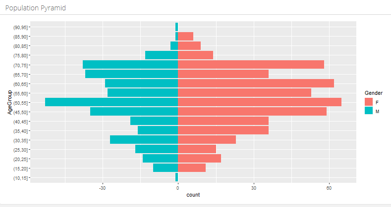

# Query SQL via dplyr

The script included provides an example of the use of dplyr in R to query a SQL database. This is done via the package dbplyr, which allows you to access remote database tables as if they are in-memory data frames by automatically converting dplyr code into SQL. 

I used this methodology when querying a large clinical database stored in SQL. The query was designed to extract clinical records based on a user inputting the required clinical read codes. Using dbplyr meant not having to import the entire dataset into memory. The script only imports the data after it has been filtered for specific read codes, based on the user’s input.

Also included in the R Markdown file is code to produce a population pyramid, for example:

In addition, the UI includes a selector that allows for entry of multiple read codes, as well as an auto-complete function.

